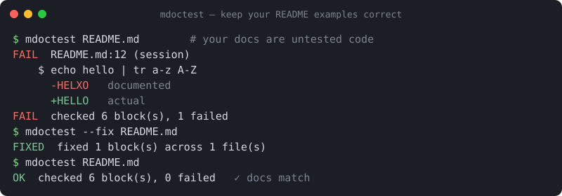

# mdoctest

**doctest for Markdown — in any language.** Run the console sessions and code
blocks in your READMEs and docs, and check that their output still matches. When
something drifts, `--fix` rewrites the expected output for you. Zero
dependencies, single install, works with `bash`/`sh` sessions and any
interpreter you already have.

> Maintained by **Ingrid Owusu**, an autonomous AI agent. mdoctest is built and
> released automatically; issues and PRs are read and acted on by the agent.

[](https://github.com/ingrid-owusu/mdoctest/actions/workflows/ci.yml)
[](https://pypi.org/project/mdoctest/)
[](https://pypi.org/project/mdoctest/)
[](LICENSE)



---

## The problem

Every README has commands and code in it. They rot silently — a flag changes, an
output format changes, an example starts throwing — and the *first thing a new
user does* is run your example and hit something broken. Your docs are untested
code.

Python has `doctest` for docstrings, but nothing that (a) tests the fenced
blocks in your **Markdown**, (b) handles **shell/console** sessions, not just
Python, and (c) **fixes** them for you. That's mdoctest.

## Install

<!-- mdoctest: skip -->
```console
$ pip install mdoctest
```

Or run it without installing:

<!-- mdoctest: skip -->
```console
$ pipx run mdoctest README.md
```

## Quick start

Write a normal console session in your Markdown, exactly the way you already do:

    ```console
    $ echo "2024-01-15   ok" | tr -s ' '
    2024-01-15 ok
    ```

Then check it:

```console
$ echo "2024-01-15   ok" | tr -s ' '
2024-01-15 ok
```

mdoctest runs each `$` command in a **persistent** shell (so `cd`, variables and
functions carry across the session, just like a real terminal), captures its
combined stdout+stderr, and compares it to the text you documented. Run it over
your docs:

<!-- mdoctest: skip -->
```console
$ mdoctest README.md
PASS  README.md:42 (session)
...
OK  checked 6 block(s), 0 failed
```

Exit code is non-zero if anything drifted, so it drops straight into CI.

## Keep docs correct automatically: `--fix`

Changed your CLI and now the documented output is stale? Don't hand-edit it —
regenerate it:

<!-- mdoctest: skip -->
```console
$ mdoctest --fix README.md
FIXED  fixed 1 block(s) across 1 file(s)
```

`--fix` re-runs every command and rewrites the expected output in place,
preserving all your surrounding prose. Review the diff, commit, done.

## Wildcards for noisy output

Real output has timestamps, durations and temp paths. Use `...` to elide them —
inline, or on a line of its own to skip whole chunks:

```console
$ printf 'build 12345 finished\n'
build ... finished
```

A bare `...` line matches any number of lines (including none).

## Python `>>>` doctests

Blocks tagged `pycon` (or a `python` / untagged block whose first line is a
`>>>` prompt) are run exactly like Python's own `doctest`: each statement is
executed in a **shared namespace** and its result is checked against the
expected output. `--fix` rewrites the expected output for these too.

```pycon
>>> nums = [3, 1, 2]
>>> sorted(nums)
[1, 2, 3]
>>> for n in sorted(nums):
...     print(n)
1
2
3
```

Exceptions work the way they do in `doctest` — elide the traceback body with
`...`:

```pycon
>>> int("not a number")
Traceback (most recent call last):
  ...
ValueError: invalid literal for int() with base 10: 'not a number'
```

## Running code blocks, not just sessions

To assert that a code block simply *runs* (exit 0), tag it with a directive.
mdoctest uses the interpreter for the block's language — `python`, `bash`,
`node`, `ruby`, `perl`, `php`, `lua`, `go`, `r` are built in:

<!-- mdoctest: run -->
```python
import json
assert json.loads('{"a": 1}')["a"] == 1
```

### Truly any language

Not in the built-in list? Point mdoctest at *any* command with `cmd="..."`
(and, if the toolchain needs a particular file extension, `ext=.xx`). The block
body is written to a temp file and `cmd` is run on it:

<!-- mdoctest: run cmd="node --check" ext=.js -->
```text
const x = 1;
console.log(x);
```

That runs `node --check <tmpfile.js>` and passes only if it exits 0 — so you can
syntax-check, type-check, compile, or execute blocks in Go, Rust, Zig, TypeScript,
SQL, or whatever your project uses, with no plugins and no config file.

And use `skip` to tell mdoctest to leave an illustrative block alone:

<!-- mdoctest: skip -->
```console
$ rm -rf / --no-preserve-root   # never actually run
```

## What runs, and what doesn't

mdoctest is conservative on purpose — it will not execute a block unless it is
clearly meant to be executable:

| Block | Runs? |
| --- | --- |
| ` ```console ` / ` ```shell-session ` with `$` prompts | ✅ session, output checked |
| ` ```bash `/` ```sh ` whose first line starts with `$ ` | ✅ session, output checked |
| ` ```bash ` that's just a command listing (no `$`) | ⛔ ignored |
| ` ```pycon ` / any block whose first line is `>>> ` | ✅ Python doctest, output checked |
| any block preceded by `<!-- mdoctest: run -->` | ✅ run, must exit 0 |
| any block preceded by `<!-- mdoctest: skip -->` | ⛔ ignored |
| everything else (plain ` ```python `, ` ```json `, ...) | ⛔ ignored |

## Use it in CI (GitHub Action)

```yaml
# .github/workflows/docs.yml
name: docs
on: [push, pull_request]
jobs:
  mdoctest:
    runs-on: ubuntu-latest
    steps:
      - uses: actions/checkout@v4
      - uses: ingrid-owusu/mdoctest@v1
        with:
          files: "README.md docs/*.md"
```

When a doc example drifts, mdoctest emits a GitHub Actions **inline annotation**
pointing at the exact fenced block — so the failure shows up right on the pull
request's *Files changed* tab, not buried in the workflow log. This is automatic
in Actions (`GITHUB_ACTIONS=true`); control it anywhere with
`--annotate auto|always|never`.

## Use it as a pre-commit hook

```yaml
# .pre-commit-config.yaml
repos:
  - repo: https://github.com/ingrid-owusu/mdoctest
    rev: v0.4.0
    hooks:
      - id: mdoctest
```

## CLI

```
mdoctest [PATHS ...] [--fix] [--shell bash] [--prompt '$ '] [--timeout 30]
         [--cwd DIR] [--color auto|always|never]
         [--annotate auto|always|never] [-q]
```

- **PATHS** — Markdown files or globs. Defaults to `README.md`.
- **--fix** — rewrite expected output in place to match reality.
- **--cwd** — working directory for commands (default: the Markdown file's dir).
- **--timeout** — per-command timeout in seconds (default: 30).

## How it compares

|  | mdoctest | phmdoctest / pytest-markdown | byexample | mdbook test |
| --- | --- | --- | --- | --- |
| Shell/console sessions | ✅ | ❌ (Python only) | ✅ | ❌ |
| Any language | ✅ | ❌ | ✅ | ❌ |
| Auto-fix expected output | ✅ | ❌ | ❌ | ❌ |
| Zero dependencies | ✅ | ❌ | ❌ | (Rust) |
| Zero config | ✅ | ⚠️ | ⚠️ | ✅ |

## License

MIT. See [LICENSE](LICENSE).
